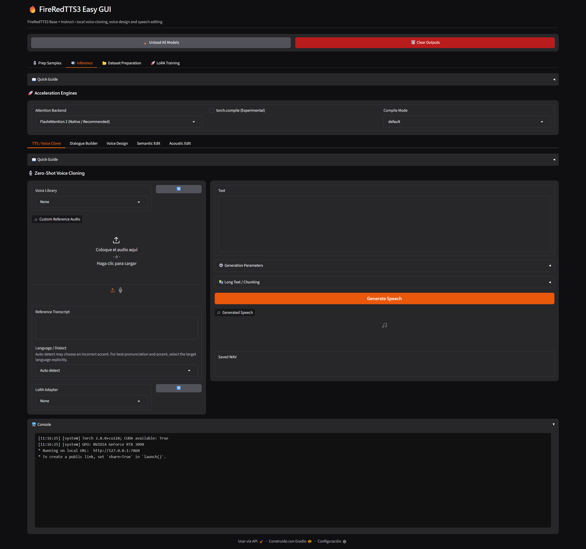
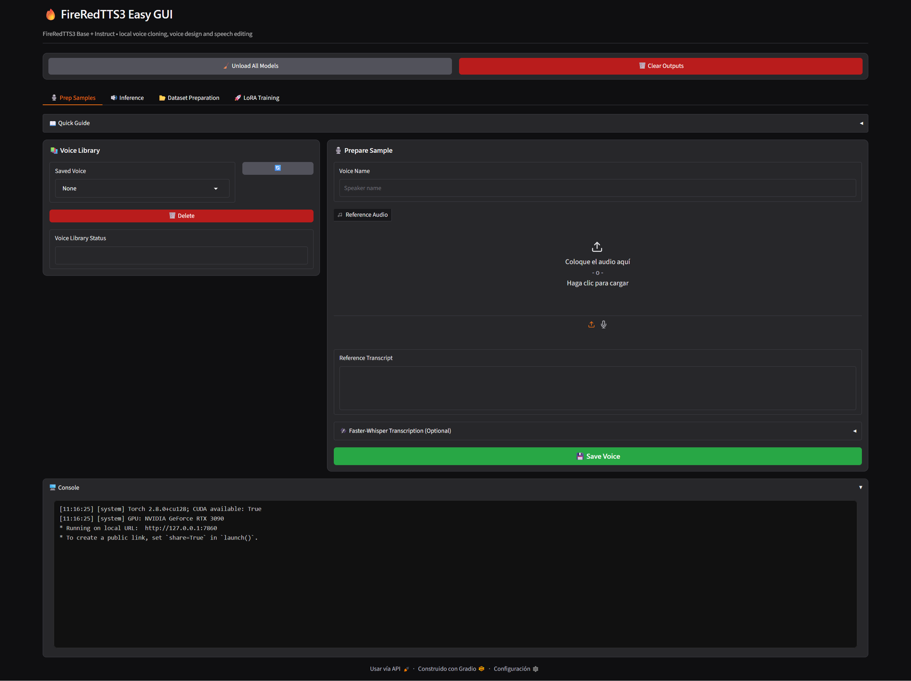
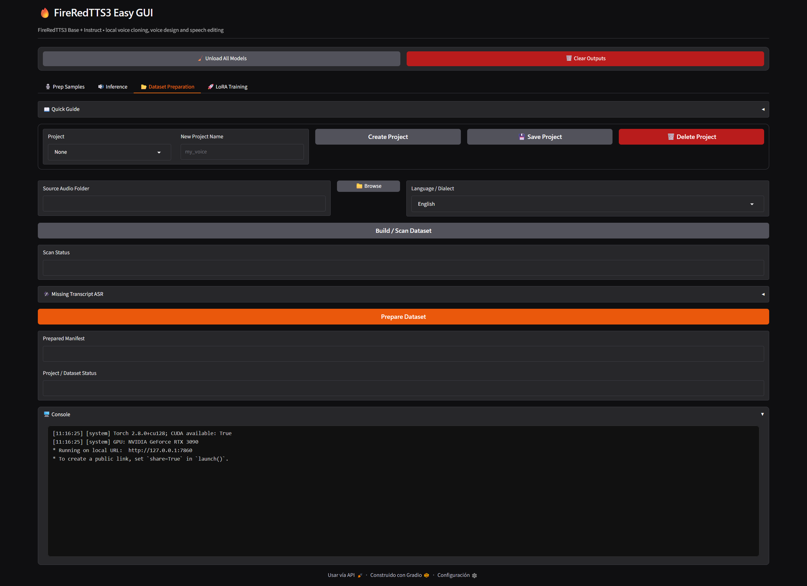
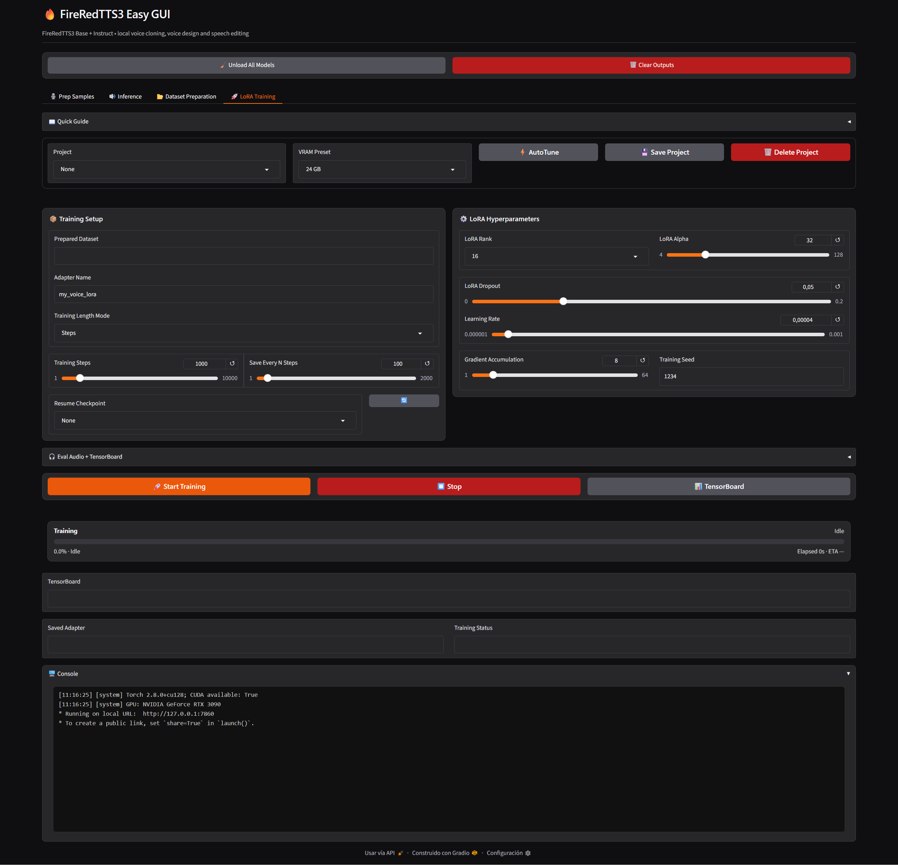

# 🔥 FireRedTTS3 Easy GUI: Voice Cloning + Speech Editing + LoRA Training

A Windows WebUI for **FireRedTTS3**, bringing together multilingual zero-shot voice cloning, instruction-driven voice design, semantic and acoustic speech editing, reusable voice libraries, dialogue generation, dataset preparation, and experimental LoRA voice training in a single local workflow.



---

## ✨ Feature Overview

| Area | What it does |
| :--- | :--- |
| **Voice Clone** | Generate speech from a reference recording and its transcript with FireRedTTS3-Base. |
| **Voice Design** | Create a new voice from a natural-language description with FireRedTTS3-Instruct. |
| **Semantic Edit** | Insert, delete, or replace spoken content from an existing recording. |
| **Acoustic Edit** | Modify supported speech attributes such as speed, pitch, and volume. |
| **Dialogue Builder** | Build turn-by-turn conversations using independent saved voices. |
| **Voice Library / Prep Samples** | Save reusable reference voices, transcripts, and prepared samples. |
| **Long-Form Generation** | Optionally split large text into multiple synthesis passes and merge the outputs automatically. |
| **Faster-Whisper** | Transcribe reference, dataset, semantic-edit, and evaluation audio locally. |
| **LoRA Training** | Train experimental FireRedTTS3-Base voice-cloning LoRAs on a single NVIDIA GPU. |
| **AutoTune** | Analyze the prepared dataset and suggest conservative LoRA/training settings. |
| **Checkpoint + Eval Audio** | Save intermediate LoRA checkpoints and generate comparable evaluation samples. |
| **TensorBoard** | Monitor smoothed/raw training loss, learning rate, gradient norm, and evaluation audio. |

---

## 🧠 FireRedTTS3 Models

FireRedTTS3 is released as two complementary models.

| Model | Main Use |
| :--- | :--- |
| **FireRedTTS3-Base** | Zero-shot voice cloning and multilingual speech generation. |
| **FireRedTTS3-Instruct** | Voice design plus semantic and acoustic speech editing. |

### FireRedTTS3-Base

The Base model is the primary **voice-cloning** engine used by the Easy GUI.

It supports **24 languages** and **21 Chinese dialects**. For the most reliable pronunciation and accent, the GUI exposes an explicit **Language / Dialect** selector.

Supported languages:

`Arabic` · `Cantonese` · `Chinese` · `Czech` · `Dutch` · `English` · `Finnish` · `French` · `German` · `Greek` · `Hindi` · `Indonesian` · `Italian` · `Japanese` · `Korean` · `Polish` · `Portuguese` · `Romanian` · `Russian` · `Spanish` · `Thai` · `Turkish` · `Ukrainian` · `Vietnamese`

Supported Chinese dialects:

`Anhui` · `Fujian` · `Gansu` · `Guizhou` · `Hebei` · `Henan` · `Hubei` · `Hunan` · `Jiangxi` · `Liaoning` · `Minnan` · `Ningxia` · `Shaanxi` · `Shandong` · `Shanghai` · `Shanxi` · `Sichuan` · `Tianjin` · `Wenzhou` · `Wu` · `Yunnan`

> **Language note:** FireRedTTS3 can auto-detect language, but automatic detection can occasionally select an unintended accent. For inference, explicitly selecting the target language or dialect is recommended.

### FireRedTTS3-Instruct

The Instruct model powers three workflows inside the GUI:

- **Voice Design** — generate a new voice from a written description;
- **Semantic Edit** — change spoken content while keeping the surrounding speech context;
- **Acoustic Edit** — modify supported acoustic attributes of existing speech.

The model is loaded on demand and reused while it remains resident in memory.

---

## 🛠️ Requirements

| Requirement | Recommended |
| :--- | :--- |
| **OS** | Windows 10 / 11 x64 |
| **RAM** | 32 GB+ |
| **GPU** | NVIDIA CUDA GPU |
| **VRAM** | 16 GB+ |
| **LoRA Training** | 24 GB+ VRAM recommended |

---

## 📦 Installation

Run:

```bat
1- install.bat
```

The installer creates the **project-local Python environment** and installs the dependencies required by the Easy GUI.

Model weights are downloaded automatically when a workflow needs them for the first time and are reused on later launches.

---

## ▶️ Launch

Run:

```bat
2- run.bat
```

The WebUI opens locally in your browser.

---

## 🎙️ Voice Library / Prep Samples



The **Voice Library / Prep Samples** workflow creates reusable reference voices for inference, dialogue, and evaluation.

A voice entry combines:

- reference audio;
- the matching transcript;
- reusable metadata required by the Easy GUI.

You can use this area to:

- load and preview reference recordings;
- transcribe audio with Faster-Whisper;
- save clean reference voices;
- refresh voice selectors without restarting the GUI;
- reuse the same voice in Voice Clone and Dialogue Builder;
- maintain voice assets independently from individual inference sessions.

Saved voices are stored under:

```text
voices/
```

---

## 🗣️ TTS / Voice Clone

**TTS / Voice Clone** is the main FireRedTTS3-Base inference workflow.

Provide either:

- a saved **Voice Library** entry; or
- custom reference audio plus its exact transcript.

Then select:

- target **Language / Dialect**;
- optional trained **LoRA Adapter**;
- inference CFG;
- diffusion timesteps;
- fixed or random seed;
- text normalization;
- optional long-text chunking.

Generated audio is saved under:

```text
outputs/
```

### Reference Audio

The reference audio establishes the speaker identity and speaking characteristics used for zero-shot cloning.

For best results:

- use clean speech;
- avoid music and heavy background noise;
- use an accurate transcript;
- prefer a reference spoken in the same language or dialect as the target when possible.

### Language / Dialect

`Auto-detect` is available for convenience, but explicit selection is preferable when pronunciation or accent consistency matters.

This is especially important when:

- the text is short;
- several languages share similar orthography;
- the target accent is important;
- a Chinese dialect is required.

---

## 📖 Long-Form Generation

The **Long Text / Chunking** controls are optional and default to:

```text
None
```

This keeps normal inference as a single synthesis pass unless the user explicitly enables segmentation.

Available splitting strategies can break large text at practical linguistic boundaries and then merge the generated clips automatically.

The **Silence Between Chunks** control determines the gap inserted between generated segments.

Long-form mode is useful for:

- narration;
- articles;
- scripts;
- long monologues;
- text that is unstable or inefficient as a single generation.

For short and medium text, leaving Chunk Mode on `None` is generally the cleanest workflow.

---

## 👥 Dialogue Builder

The **Dialogue Builder** follows the turn-by-turn approach.

Each dialogue row contains:

- a saved voice;
- the text for that turn;
- row controls for adding, cloning, deleting, clearing, or reordering turns.

Each turn is synthesized independently through FireRedTTS3-Base and the generated WAVs are joined in row order.

A global **Pause Between Turns** control determines the silence inserted between speakers.

This approach allows conversations to use multiple independent Voice Library entries without requiring a dedicated multi-speaker decoder.

---

## 🎨 Voice Design

**Voice Design** uses FireRedTTS3-Instruct to create a new voice from a natural-language description without requiring reference audio.

A description can specify characteristics such as:

- perceived age;
- timbre;
- emotion;
- speaking style;
- pace;
- accent;
- articulation;
- vocal character.

The GUI also displays the model-generated **Voice Plan** returned by FireRedTTS3-Instruct.

The selected **Language / Dialect** applies to the text frontend and should be chosen explicitly whenever possible.

---

## ✂️ Semantic Edit

**Semantic Edit** changes the spoken content of an existing recording.

Typical tasks include:

- insertion;
- deletion;
- substitution;
- rewriting a specific spoken fragment.

The GUI accepts an input recording and a natural-language edit instruction, then returns:

- the edited audio;
- the edited/reconstructed text reported by the model;
- the saved WAV path.

Faster-Whisper can be used when a transcription of the source audio is useful for preparing the edit.

---

## 🎚️ Acoustic Edit

**Acoustic Edit** modifies supported speech attributes while retaining the source content.

The current GUI exposes the trained FireRedTTS3 acoustic-edit controls for:

- **Speed**
- **Pitch**
- **Volume**

These controls are translated internally into the instruction templates expected by FireRedTTS3-Instruct.

This makes the feature easier to use than manually writing the model-specific instruction syntax.

---

## ⚡ Acceleration

The supported inference runtime is **PyTorch / Transformers**.

The Easy GUI exposes optional acceleration controls for supported Windows/NVIDIA configurations:

### FlashAttention 2

FlashAttention 2 can reduce attention memory traffic and improve the attention path of the transformer backbone.

FireRedTTS3 attention must run in a supported reduced-precision datatype such as FP16/BF16. The GUI/runtime handles the required attention path automatically.

### torch.compile

`torch.compile` can be enabled for compatible workflows.

Available compile modes are intentionally kept simple:

- `default`
- `reduce-overhead`

The project uses **triton-windows** where required for Windows `torch.compile` support.

Acceleration remains optional; model correctness does not depend on enabling these controls.

---

## 🎧 Faster-Whisper Transcription

Faster-Whisper is integrated into the workflows where transcription is useful.

It can be used for:

- Voice Library reference transcription;
- dataset preparation;
- semantic-edit source transcription;
- training evaluation reference transcription.

Whisper language selection defaults to:

```text
Auto-detect
```

This is appropriate for transcription because the model is identifying the language of existing speech rather than controlling the accent of newly generated speech.

---

## 📚 Dataset Preparation



Training begins with a prepared dataset project.

A simple source dataset can use matching audio and transcript filenames:

```text
dataset/
├── 000001.wav
├── 000001.txt
├── 000002.wav
├── 000002.txt
└── ...
```

The GUI provides:

- a native folder browser;
- dataset scanning;
- transcript handling;
- Faster-Whisper assistance;
- prepared JSONL generation;
- project save/load;
- restoration of dataset and training fields.

Prepared datasets and project metadata are kept separate from the original source files.

---

## 🧬 LoRA Training



The **LoRA Training** tab provides experimental single-GPU voice-cloning training for FireRedTTS3-Base.

The training UI is organized around:

- project management;
- VRAM preset;
- AutoTune;
- training-length mode;
- LoRA hyperparameters;
- checkpoint cadence;
- evaluation audio;
- TensorBoard;
- resume-from-checkpoint.

Training outputs are stored under:

```text
training/outputs/
```

### Training Length Mode

Training uses one explicit unit at a time.

#### Steps

Choose:

- **Training Steps**
- **Save Every N Steps**

If `Training Steps = 1500`, the run performs exactly 1500 optimizer steps.

If `Save Every N Steps = 150`, checkpoints and evaluation audio are generated at approximately:

```text
150
300
450
...
1500
```

#### Epochs

Choose:

- **Training Epochs**
- **Save Every N Epochs**

If `Training Epochs = 20`, the dataset is processed for exactly 20 complete passes.

If `Save Every N Epochs = 2`, checkpoints and evaluation audio are generated after epochs:

```text
2
4
6
...
20
```

The two modes do not overlap. Only the controls belonging to the selected mode are active.

For most voice-cloning datasets, **Steps** is the preferred AutoTune recommendation because optimizer updates provide a predictable training and checkpoint unit.

---

## ⚙️ AutoTune

**AutoTune** analyzes the prepared dataset and proposes a conservative starting configuration.

The current heuristics consider:

- sample count;
- total dataset duration;
- median clip duration;
- upper-duration percentiles;
- duration variability;
- selected VRAM preset.

AutoTune can adjust:

- Training Length Mode;
- Training Steps / Epochs;
- checkpoint cadence;
- LoRA rank;
- LoRA alpha;
- learning rate;
- gradient accumulation.

The current strategy deliberately favors stable **Steps** training for normal small and medium voice datasets.

The suggested values are starting points rather than immutable requirements; the main hyperparameters remain editable.

---

## 📈 Training Stability & Metrics

The experimental trainer uses several safeguards intended to make small voice datasets easier to evaluate:

- conservative AutoTune learning rates;
- gradient accumulation;
- gradient clipping;
- AdamW optimization;
- warmup;
- cosine learning-rate decay;
- smoothed EMA training metrics;
- raw training metrics retained separately;
- additional stop-target sampling;
- checkpoint evaluation audio.

The main TensorBoard curves are smoothed to make the optimization trend easier to read.

Raw values remain available under separate `train_raw/*` metrics for detailed inspection.

---

## 💾 Checkpoints & Resume

Intermediate checkpoints are stored inside the selected training output directory.

Checkpoint names reflect the selected training unit.

Examples:

```text
checkpoint-step-000500/
checkpoint-step-001000/
```

or:

```text
checkpoint-epoch-0005/
checkpoint-epoch-0010/
```

The **Resume Checkpoint** selector can restore an available training checkpoint and continue the run.

Trainer state includes optimizer and scheduler information required by the experimental resume workflow.

---

## 🎧 Evaluation Audio

Evaluation audio provides a practical way to judge voice similarity and training progress without waiting for the final adapter.

Configure:

- Eval Text;
- Eval Reference Audio;
- Eval Reference Transcript;
- Eval Language.

The reference transcript can be generated directly from the GUI with Faster-Whisper.

When evaluation generation is enabled, the trainer creates WAV samples at the same cadence used for checkpoint saving.

Evaluation audio is stored under the selected training output.

---

## 📊 TensorBoard

TensorBoard can be launched directly from the Training tab.

The trainer records metrics including:

- smoothed training loss;
- smoothed flow loss;
- smoothed stop loss;
- raw loss values;
- learning rate;
- gradient norm;
- evaluation audio.

TensorBoard logs are stored under:

```text
training/outputs/<adapter>/tensorboard/
```

The GUI starts the local TensorBoard server and opens it in the default browser.

---

## ⏱️ Training Progress & ETA

Training includes a persistent progress component separate from the transient Gradio task indicator.

It reports:

- current Step or Epoch;
- total requested training length;
- completion percentage;
- current training state;
- elapsed time;
- estimated time remaining.

ETA is calculated from the observed speed of the current run and becomes more representative as training progresses.

---

## 💾 Training Projects

Training projects keep dataset and experiment settings together so work can be resumed later.

Saved project state includes the relevant fields for:

- dataset location;
- prepared manifest;
- adapter name;
- VRAM preset;
- LoRA hyperparameters;
- Steps/Epochs mode;
- checkpoint cadence;
- evaluation configuration;
- evaluation reference audio;
- Faster-Whisper evaluation settings.

The evaluation reference audio is copied into the project directory so it does not depend on a temporary Gradio upload path.

---

## 📁 Project Folders

| Folder | Purpose |
| :--- | :--- |
| `assets/` | GUI resources and optional `chime.wav`. |
| `fireredtts3_local/` | Easy GUI integration, model management, projects, transcription, and training helpers. |
| `fireredtts3_upstream/` | Bundled FireRedTTS3 source used by the GUI. |
| `outputs/` | Generated speech and edited audio. |
| `voices/` | Reusable reference voices and metadata. |
| `training/projects/` | Saved dataset/training projects. |
| `training/datasets/` | Prepared training datasets and manifests. |
| `training/outputs/` | LoRA adapters, checkpoints, TensorBoard logs, and evaluation audio. |
| `.venv/` | Project-local Python environment created by the installer. |

---

## 💡 Quick Guides

Each main workflow includes a compact **Quick Guide** near the top of its tab or sub-tab.

The guides explain the controls that matter for the current task without forcing the user to leave the application.

They cover areas such as:

- voice references;
- language selection;
- long-form chunking;
- dialogue;
- speech editing;
- dataset preparation;
- AutoTune;
- Steps vs Epochs;
- evaluation audio;
- TensorBoard.

For normal use, the Quick Guide is the fastest reference before changing advanced parameters.

---

## 🧹 Model Memory

The GUI includes model-memory management for large workflows.

**Unload All Models** releases active FireRedTTS3 and transcription references, runs Python garbage collection, and requests CUDA cache cleanup.

This is useful when switching between memory-heavy tasks or when preparing the GPU for another application.

---

## 📝 Notes

- **Long Text / Chunking** defaults to `None`.
- Faster-Whisper language selection defaults to `Auto-detect`.
- For generated speech, explicit **Language / Dialect** selection is recommended over automatic detection when accent matters.
- Models are downloaded on demand and reused locally.
- PyTorch is the supported inference backend.
- FlashAttention 2 and `torch.compile` are optional acceleration features.
- LoRA training is experimental.
- Training quality should be judged using evaluation audio in addition to loss curves.
- AutoTune provides a conservative starting point, not a guarantee of optimal convergence for every dataset.

---

## 🙏 Credits

### CORE PROJECT

**FireRedTeam / FireRedTTS3**

FireRedTTS3-Base and FireRedTTS3-Instruct models, inference pipelines, multilingual voice cloning, voice design, and speech editing.

GitHub: https://github.com/FireRedTeam/FireRedTTS3  
Hugging Face: https://huggingface.co/FireRedTeam/FireRedTTS3  
License: Apache-2.0


### WINDOWS ACCELERATION

**FlashAttention**

Memory-efficient attention acceleration.

GitHub: https://github.com/Dao-AILab/flash-attention  
License: BSD-3-Clause


**Triton for Windows**

Windows-compatible Triton runtime used by supported `torch.compile` configurations.

GitHub: https://github.com/woct0rdho/triton-windows  
License: MIT


### SPEECH TRANSCRIPTION

**Faster-Whisper**

Local speech transcription used by supported preparation and evaluation workflows.

GitHub: https://github.com/SYSTRAN/faster-whisper  
License: MIT

**FranckyB / Voice Clone Studio**

Inspiration for reusable local voice-library and voice-cloning workflows.

GitHub: https://github.com/FranckyB/Voice-Clone-Studio

---

## 📄 License

FireRedTTS3 is released under the **Apache-2.0** license.

FireRedTTS3 model weights, third-party libraries, acceleration components, and transcription dependencies remain subject to their respective upstream licenses and terms.

See the bundled upstream license and notice files for the original project terms.

This Easy GUI does not replace, modify, or supersede any upstream license.
